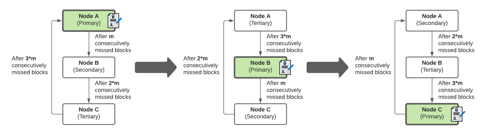

# Pairmint

Pairmint is a high availability solution for Tendermint-based blockchains. It is designed to get rid of all communication overhead between a set of redundant validator nodes running in parallel by using the blockchain itself as a perfectly synchronous communication line for double-signing protection.

## Overview

Pairmint requires a minimum of `n = 2` validator nodes to be run in parallel. Every one of these `n` nodes is part of a ranking system that determines when exactly each validator is allowed to sign blocks. The signing node is always called the Primary, while the Secondary, Tertiary, etc. make up the backup queue. Each time a certain threshold `m` of consecutively missed blocks is exceeded, each node moves up one rank in the backup queue - the Secondary becomes the Primary, the Tertiary becomes the Secondary and the Primary becomes the Tertiary.

## Flow Diagram

Fundamentally, all nodes work the same in terms of monitoring the blockchain for missed blocks and updating their ranks. The Primary is the only node with signing permission, though.

