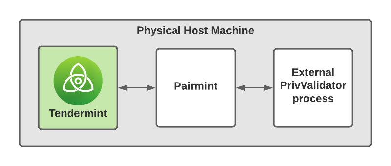

# Architecture

On a high level, SignCTRL adds a middleware layer between Tendermint and an external PrivValidator process. It acts as sort of a lockgate, only passing votes to the PrivValidator process if the validator node has the privilege/permission to actually sign it. By default, SignCTRL uses Tendermint's default file-based signer. It is, however, also compatible with the [TMKMS](https://github.com/iqlusioninc/tmkms).

## Communication

All communication is done via websockets. Messages are encrypted using the authenticated encryption scheme Station-to-Station Protocol.

TODO
