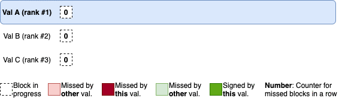

# Double-Signing Protection

This page covers how SignCTRL's underlying ranking system provided protection against double-signing.

## SignCTRL Set

A SignCTRL set consists of two or more validators that all share the same keys, and thus represent the same validator entity. Letting all of those validators sign blocks simultaneously is a sure-fire way of getting slashed for double-signing, so there needs to be some form of coordination in the set in terms of which validator has permission to sign at any given point in time. Thus, the idea is very simple - only one validator in the set should sign all blocks while the others back it up if it becomes unavailable.

Contrary to approaches that add a consensus layer and therefore more communication overhead to the set of redundant validators, like [Raft](https://raft.github.io/), SignCTRL uses the blockchain itself as a perfectly synchronous communication line that the validators in the set use to coordinate signing permissions. Let's take a closer look at how SignCTRL achieves this.

## Validator Ranking

SignCTRL employs a ranking system for the validators in its set which essentially just ranks the validators in descending order - and this ranking system is actually the key factor enabling double-signing protection.

A node's rank determines which blocks exactly it has permission to sign and which not. Only the highest-ranked validator signs blocks while the others serve as backups. The validators can move up one rank at a time if one key criterion is met - and that is if too many blocks have been missed in a row. So, rank updates are triggered by too many blocks on the blockchain being missed in a row.

In order to detect missed blocks, the validators closely monitor every single block in the blockchain. This includes looking into every last block's commit signatures and checking for the own validator's signature. If the signature is missing, every validator in the set will see it and increment an internal counter for missed blocks in a row. If a certain threshold is exceeded, ranks 2..n will notice first and accordingly move up one rank each. Once rank 1 becomes available again, it will have to sync up its blockchain state. Eventually, while syncing, it will also notice that is has been replaced and needs to shut itself down. It can then later be readded to the set with the lowest rank, though.