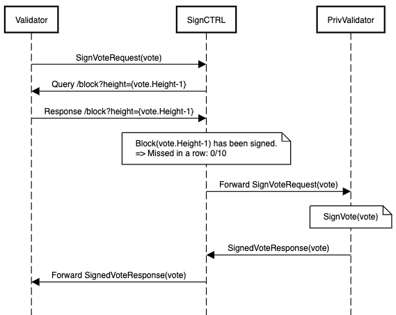
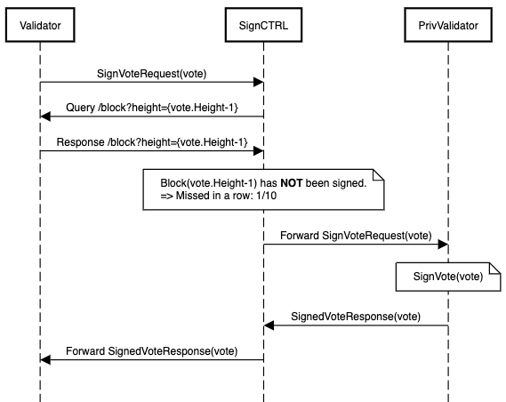
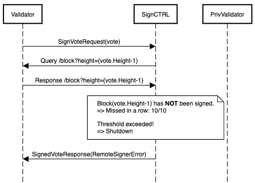
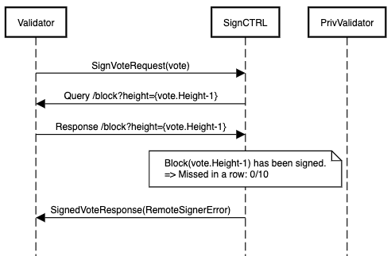
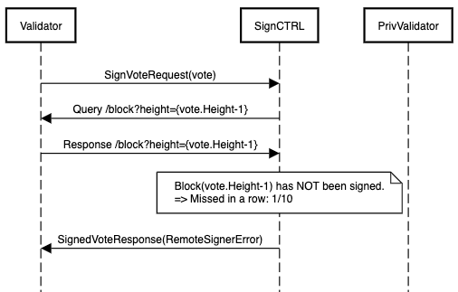
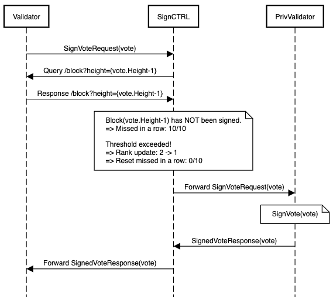

# Message Flow

SignCTRL itself doesn't sign any votes/proposals. It rather acts as a gate to the PrivValidator, meaning that it's merely in charge of passing votes/proposals to the PrivValidator if it is has permission to sign (=ranked first), and barring the way if it doesn't (=ranked second or lower). You can read more about the ranking system and how it plays into protection against double-signing [here](./ds-protection.md).

Before a sign request is handled, SignCTRL needs to make sure the current rank, and therefore the permission to sign, is still valid for the vote/proposal on the requested height. It does so by querying Tendermint's `/block` endpoint in order to check the previous/latest block for it's validator's signature and update the rank according to its internal counter for missed blocks in a row.

## Rank 1

The following sequence diagrams describe the message flow and course of actions a node with rank 1 takes when it receives requests to sign votes/proposals.

#### Happy Path

The validator's signature is found in the last block's commit, so the counter for missed blocks in a row is reset to 0. Since the signature was found, the vote is passed to the PrivValidator to be signed.

#### Missed Block

The validator's signature could **NOT** be found in the last block's commit, so the counter for missed blocks in a row is incremented by 1. However, the threshold that triggers a rank update has not yet been exceeded, so the vote is passed to the PrivValidator to be signed.

#### Threshold Exceeded

The validator's signature could **NOT** be found **too many times in a row**, so the threshold is exceeded and a rank update is triggered. Since there is no rank above 1, the node first replies with a `RemoteSignerError` to signal the lack of signing permissions to the validator, and then shuts itself down.

## Rank 2

The following sequence diagrams describe the message flow and course of actions a node with rank 2 takes when it receives requests to sign votes/proposals.

#### Happy Path

The validator's signature is found in the last block's commit, so the counter for missed blocks in a row is reset to 0. Since the node is ranked too low to sign the requested vote, it replies with a `RemoteSignerError` to signal the lack of signing permissions to the validator.

#### Missed Block

The validator's signature could **NOT** be found in the last block's commit, so the counter for missed blocks in a row is incremented by 1. However, the threshold that triggers a rank update has not yet been exceeded. Since the node is ranked too low to sign the requested vote, it replies with a `RemoteSignerError` to signal the lack of signing permissions to the validator.

#### Threshold Exceeded

The validator's signature could **NOT** be found **too many times in a row**, so the threshold is exceeded and a rank update is triggered. Since the node moves up from rank 2 to 1, it has permission to pass the vote to be signed to the PrivValidator.