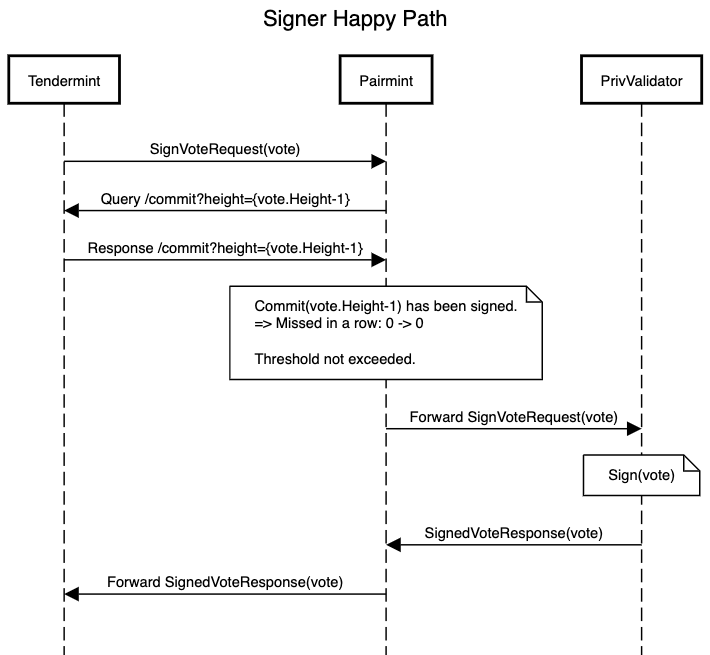
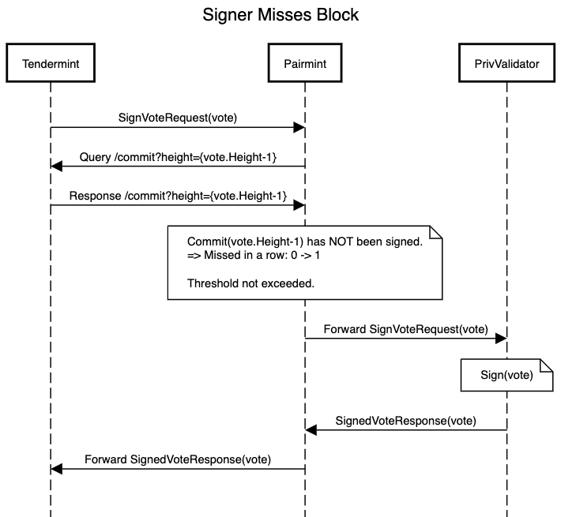
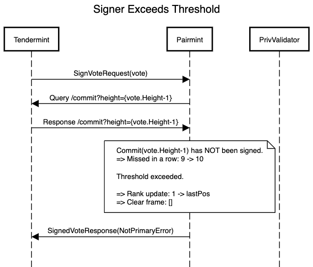
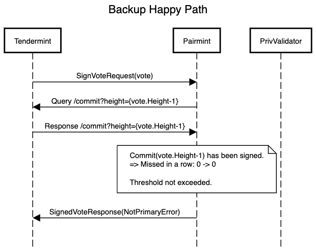
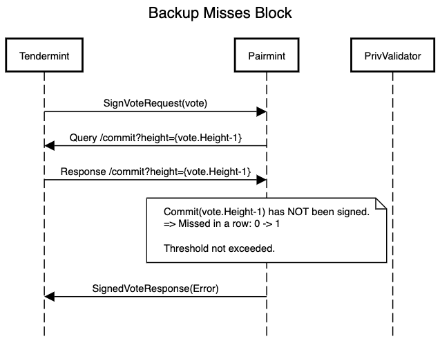
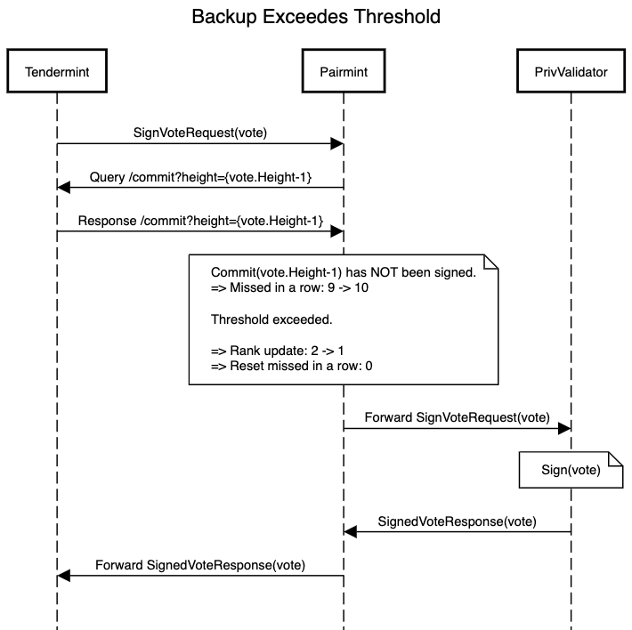

# Signing Process

Pairmint itself doesn't sign any messages. It rather functions as a lockgate to the external PrivValidator process, so it's in charge of passing votes/proposals through to the PrivValidator if, and only if, the node is actually allowed to sign according to its current rank.

## Primary Happy Path

TODO

